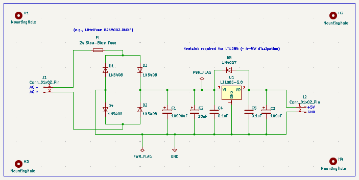
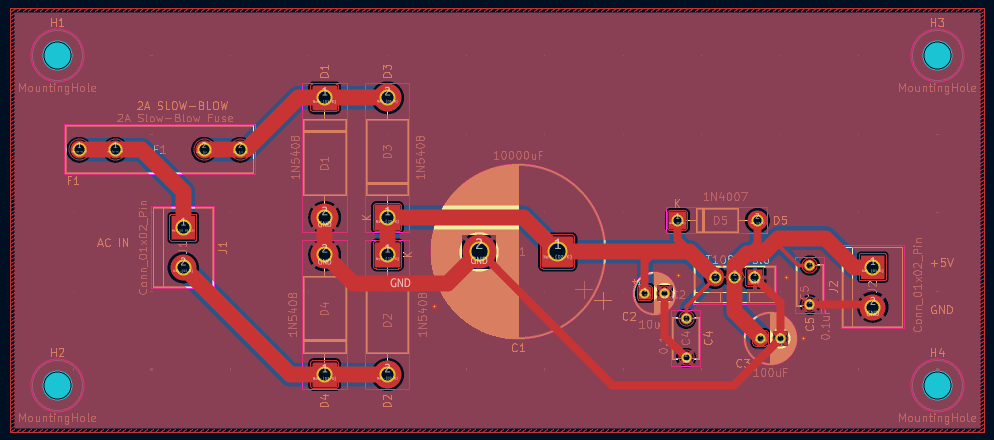
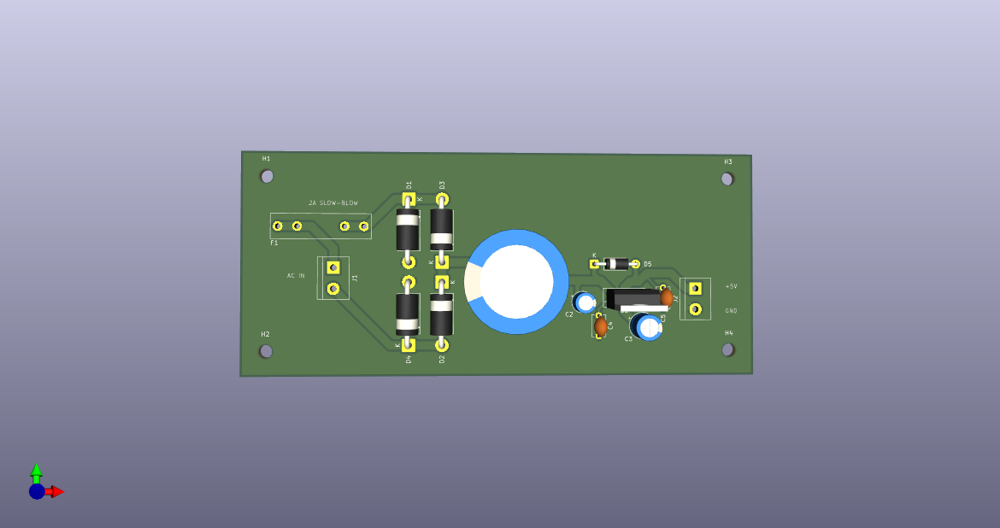
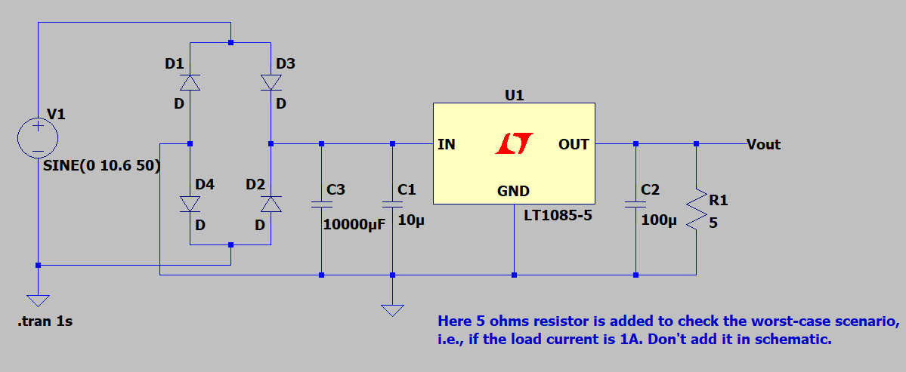
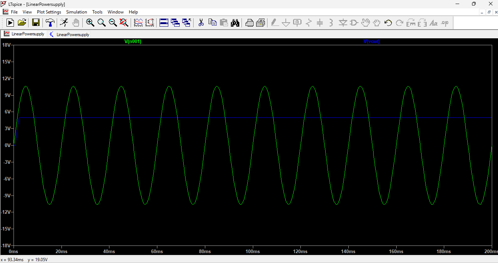

# Linear-Power-Supply

Linear power supply PCB designed in KiCad featuring schematic capture, LTSpice simulations, PCB layout, ground plane routing, Gerber generation, and BOM creation.
---

## Overview
This project is a linear power supply that converts AC input to a regulated DC output. Designed as part of my PCB design learning journey.

- **Input Voltage:** 230V AC
- **Output Voltage:** 5V DC
- **Output Current:** 1A 
- **Topology:** Linear regulation using LT1085

---

## Tools Used
- **KiCad** — Schematic capture and PCB layout
- **LTspice** — Circuit simulation

---

## Project Files
| Folder/File | Description |
|---|---|
| `Linearpowersupply_Schematic.png` | Circuit schematic |
| `Linearpowersupply_Layout.png` | PCB layout |
| `Linearpowersupply_3D.png` | 3D view of the board |
| `Linearpowersupply_Spiceschematic.png` | LTspice simulation schematic |
| `Linearpowersupply_Spicewaveform.png` | LTspice simulation waveform output |
| `gerbers/` | Gerber files ready for manufacturing |
| `BOM.csv` | Bill of Materials |

---

## Schematic

---

## PCB Layout

---

## 3D View

---

## Simulation
### Schematic

### Waveform Output

---

## What I Learned
- How to design a linear power supply from scratch
- Setting up design rules and constraints in KiCad
- Trace width calculations based on current requirements
- Proper decoupling capacitor placement
- Running simulations in LTspice
- Component Selection, Selectrion criteria of filter capacitor, rectifier diodes
- Layout constraints, Routing of traces.

---

## Manufacturing
Gerber files are available in the `gerbers/` folder.
Designed for a 2-layer PCB.

---

## License
This project is licensed under the MIT License. 
See [LICENSE](LICENSE) for details.

--

## Author
- **Sri Harshini N** – [LinkedIn](https://www.linkedin.com/in/sri-harshini-n-439b87212/) | [GitHub](https://github.com/SriHarshini2701)
